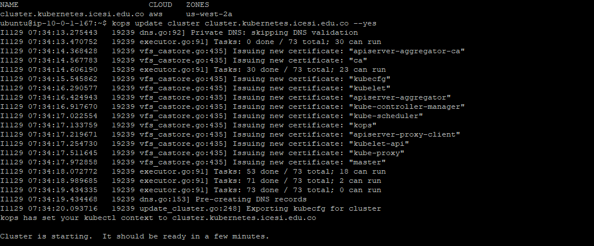

## Miniproyecto Sistemas Distribuidos

**Universidad ICESI**  
**Curso:** Sistemas Distribuidos  
**Docente:** Daniel Barragán C.  
**Tema:**  Kubernetes  
**Correo:** daniel.barragan at correo.icesi.edu.co
**Estudiantes:** Julian "Se me olvidó tu apellido", Jorge Eliecer Castaño, Jonatan Ordoñez Burbano
**Repositorio:** "Agregar repositorio"

### Objetivos
* Identificar los componentes de un cluster de kubernetes
* Desplegar un cluster de kubernetes
* Desplegar aplicaciones en un cluster de kubernetes empleando sus propiedades
de volumenes persistentes, balanceo de carga y descubrimiento de servicio
* Diagnosticar y ejecutar de forma autónoma las acciones necesarias para lograr infraestructuras estables

### Desarrollo
Para la realización de este proyecto, se utilizó el conocimiento adquirido en la electiva de Cloud Computing para trabajar el despliegue de los pods en AWS.

1. Para empezar a trabajar en AWS, se crea dos roles para tener acceso total a la manipulación de dos instancias, la primera es una EC2 y la segunda es una S3, en las cuales se realizará un despliegue de un cluster y los pods. En la siguiente imágen se observa los permisos asignados a los roles:


2. Lo siguiente que se hizo fue crear un dominio para conectar nuestras dos instancias. Se selecciona el siguiente dominio: ``kubernetes.icesi.edu.co``. En la siguiente imágen se ve nuestro dominio creado:


3. Luego creamos una Hosted Zone que es un contenedor que almacena información sobre como deseamos enrutar el tráfico de internet a nuestro dominio seleccionado. Para ello, ingresamos a la página de administración de AWS, y presionamos en Hosted Zones y en Create Hosted Zone. Aquí ingresamos el nombre de dominio que definimos en el paso anterior para el cual deseamos redireccionar el tráfico, además seleccionamos la opción 'private hosted zone' para indicar que vamos a trabajar en una red privada y por último creamos un VPC para aislar nuestros recuros computacionales de otros usuarios.


4. Lo siguiente que hacemos es crear un contenedor en nuestra instancia S3, el cual va a contener todos los archivos que necesitaremos para manejar nuestro cluster. En la siguiente imágen se observan los archivos subidos al buckets de la instancia S3:


5. Ahora, nos conectamos a nuestra instancia EC2 para instalar aws y crear los certificados ssh para poder enlazar la instancia con el cluster sin que hayan errores:


* El siguiente comando puede ser ejecutado para crear los certificados:

```
~$ ssh-keygen
```


* Ejecutamos el siguiente comando para instalar el cliente de aws dentro de nuestra instancia:

```
~$ $ pip install awscli --upgrade --user
```


6. Lo siguiente que se hace es instalar kubectl que permite crear clústeres mediante línea de comandos. Esto lo hacemos con los siguientes comando:

```
$ curl -LO https://storage.googleapis.com/kubernetes-release/release/$(curl -s https://storage.googleapis.com/kubernetes-release/release/stable.txt)/bin/linux/amd64/kubectl
$ chmod +x ./kubectl
$ sudo mv ./kubectl /usr/local/bin/kubectl
```

7. Para poder manipular kubernetes en las instancias de AWS, debemos instalar kops. Kops permite crear, destruir, actualizar y mantener, cluster de kubernetes a través de lineas de comandos. Para descargar kops ejecutamos los siguientes comandos los cuales descargan los archivos de un repositorio de github:

```
~$ wget https://github.com/kubernetes/kops/releases/download/1.8.1/kops-linux-amd64
~$ chmod +x kops-linux-amd64
~$ sudo mv kops-linux-amd64 /usr/local/bin/kops
```

8. Debido a que kops necesita conocer la referencia la instancia S3 que servirá de bucket para almacenar los clusters, ejecutamos el siguiente comando que almacena dicha referencia en una variable de kops:

```
~$ export KOPS_STATE_STORE=s3://cluster.kubernetes.icesi.edu.co
```

9. Después de tener instalado kops y almacenar la referencia del cluster en una variable, ejecutamos el siguiente comando para crear nuestro cluster:

```
~$ kops create cluster --cloud=aws --zones=us-east-1a --name=cluster.kubernetes.icesi.edu.co --dns-zone=cluster.icesi.edu.co --dns private
```
En la siguiente imágen podemos ver que el cluster se ha creado correctamente:


10. Finalmente, inicializamos nuestro cluster con el siguiente comando:

```
~$ kops update cluster cluster.kubernetes.icesi.edu.co --yes
```

En la siguiente imágen se observa la ejecución del comando:



11. Después de ejecutar este comando, ya se han agregado archivos de configuración al buckets de clusters:


12. Para verificar que el levantamiento de los nodos fue exitoso, ingresamos al administrador de AWS, en la pestaña de instancias:


